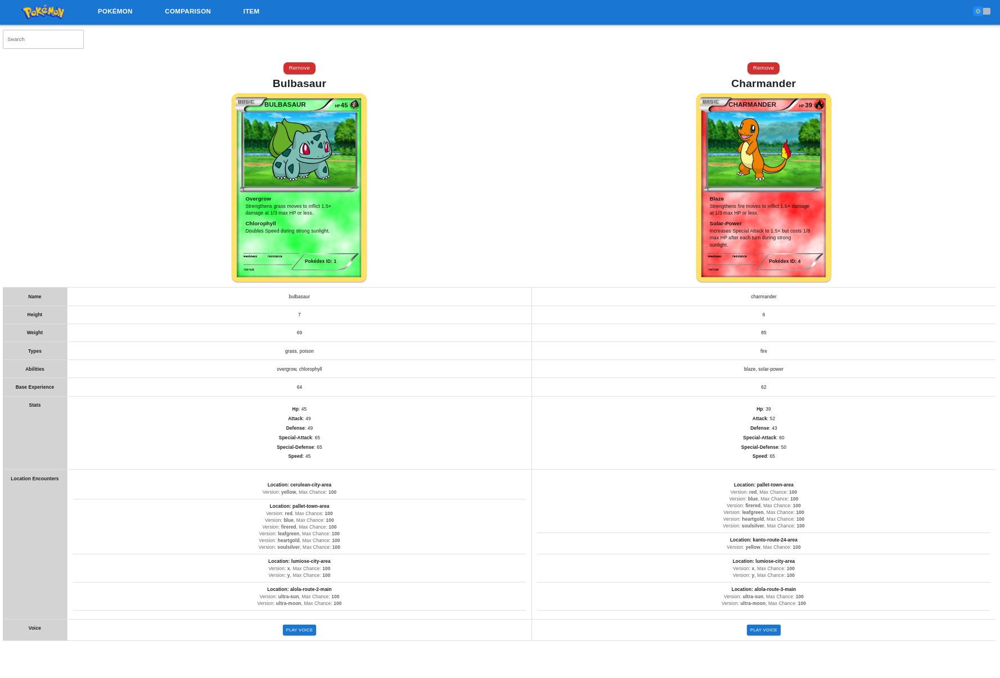

# Pokémon Web Wiki-App

## Overview

This project is a frontend web application that offers a rich and interactive way to explore data from the [PokéAPI](https://pokeapi.co/).

Inspired by the idea of a PokéWiki, it allows users to browse, search, and filter Pokémon and items through a clean and dynamic interface.

Key features include:
- A grid view of Pokémon cards with essential info
- A switchable table layout for detailed listings
- A comparison tool to analyze 2 to 4 Pokémon side by side
- A dedicated page for browsing all items
- Detailed pages for each individual Pokémon or item

The goal is to deliver an intuitive and enjoyable experience for Pokémon fans who want to dive deeper into the Pokemon universe.

## Approach & Decisions

The idea behind this project was to build an accessible and intuitive PokéWiki-style frontend application.  
We also aimed to improve our teamwork skills while gaining hands-on experience with GitHub collaboration, frontend development, and deployment pipelines.

We adopted a mostly **client-side rendering approach** using modern frontend technologies such as React, TypeScript, Axios, Tailwind CSS, Material UI, and Next.js, with deployment handled through Vercel.

While working with the [PokéAPI](https://pokeapi.co/), we encountered some limitations due to its structure. In many cases, retrieving detailed information (even for basic Pokémon data) required multiple API calls. To handle this efficiently, we implemented **pagination and background loading**, storing the fetched data in a `useRef` to avoid unnecessary re-renders and provide a smooth user experience without noticeable delays.

Due to time constraints, some **compromises** were made between design and functionality. Certain features were simplified, and styling choices were sometimes dictated by implementation speed rather than ideal UX. Despite that, we maintained a clean structure that made navigation and interaction straightforward.

Some planned features had to be postponed to keep the scope realistic. Additionally, we began writing unit tests using Jest, but couldn’t complete full coverage due to time limitations and the need to prioritize core functionality.

### Collaboration & Project Management

The project was developed collaboratively by a team of three.  
We used **GitHub Projects** to manage our tasks and milestones, creating structured **issues** for each feature or bug.  
Each contribution was submitted via **pull requests**, enabling team members to review code, suggest improvements, and ensure quality before merging.  
This approach encouraged communication, transparency, and consistent progress throughout the development cycle.

## Tech Stack

Here is an overview of the technologies used in this project, along with the reasons for their selection:

###  Frontend

- **React** – Core library for building the user interface. React was chosen for its component-based architecture, which makes it easier to manage complex UIs and enhances code reusability and maintainability. It is also widely adopted in the developer community, ensuring strong support and resources.

- **Next.js** – Framework used mainly for project structure and routing. Next.js was selected for its easy setup and built-in routing, along with its strong SEO capabilities and server-side rendering (SSR) options. These features help with performance optimization and ensure the project is scalable and maintainable.

- **TypeScript** – Provides static typing for safer and more maintainable code. TypeScript was chosen to catch errors early during development and to improve overall code quality, especially in large projects where type safety helps in managing complex interactions between components.

- **Axios** – For handling HTTP requests to the PokéAPI. Axios was selected because it simplifies making HTTP requests with support for promises and async/await, allowing for cleaner and more readable code. It also handles JSON data natively and offers built-in request cancellation, which is helpful for managing API calls efficiently.

- **Tailwind CSS** – Utility-first CSS framework for fast and responsive styling. Tailwind was chosen for its flexibility and rapid prototyping capabilities. With Tailwind, it’s easy to create a custom, responsive design without writing custom CSS, and it allows for better performance through reduced CSS file sizes.

- **Material UI (MUI)** – Used for selected UI components and layout support. MUI was used to implement pre-designed, accessible UI components (such as buttons, sliders, and forms). It saves time on design implementation and ensures a consistent look and feel across the app, following modern material design principles.

### Code Quality & Tooling

- **ESLint** – Used to enforce consistent code style and catch common bugs early. This helps maintain a clean and readable codebase throughout the development process.

### API

- **PokéAPI** – Public RESTful API that provides comprehensive Pokémon data. PokéAPI was chosen because of its vast amount of detailed data about Pokémon, items and abilities. It is free to use and well-documented, making it the ideal choice for this project.

### Deployment

- **Vercel** – Platform used to deploy and host the frontend application. Vercel was selected due to its seamless integration with Next.js and its ability to handle automatic deployments from GitHub. It provides excellent support for serverless functions, making it perfect for our needs without worrying about managing infrastructure.

### Testing (Partial)

- **Jest** – JavaScript testing framework for unit testing (partially implemented). Jest was selected because it integrates well with React and is easy to set up. It provides a robust and flexible testing environment, with great support for mocks and spies, ensuring that we could test our components and logic thoroughly.

## Installation & Setup
To run the project locally, follow these steps:

```bash
git clone git@github.com:EdwardZota/poke-app.git
cd poke-app
npm install
npm run dev
```
This will start the app in development mode and open it on http://localhost:3000.

## Development Commands

The following commands are available via npm:

- `npm run dev` – Start the development server with hot reloading.
- `npm run build` – Builds the project for production.
- `npm run start` – Run the production-ready build locally.

## Features

The Pokémon Wiki offers the following key features for an enhanced user experience:

### 1. Pokémon Grid View
- The main page displays Pokémon in a grid format, allowing users to view basic information about each Pokémon.
- Users can choose to display 5,10,table 20, or 50 Pokémon per page.
- The grid can be switched to a **list view** for more detailed information.
- **Filters** allow users to narrow down results by Pokémon type.
- A **search bar** enables users to quickly find Pokémon by name.
- A **Dark/Light mode toggle** is available in the navbar, allowing users to switch between themes at any time.
  
  

### 2. Pokémon Table View
- The table view offers more detailed information than the grid view, displaying attributes like stats, abilities, and more for each Pokémon.
  

### 3. Pokémon Filtering
- Users can filter Pokémon by **type** (e.g., Fire, Water, Electric).
- Future plans include adding filters for **region** and other attributes.
  

### 4. Pokémon Search
- The search bar allows users to search for Pokémon by name.
- The first 5 results will be shown, each with a thumbnail image.
- Clicking on a Pokémon’s name takes the user to the **detailed Pokémon page**.
  

### 5. Pokémon Detail Page
- The detailed Pokémon page provides in-depth information about the selected Pokémon.
- Users can interact with the page by clicking on an evolution to view its details or by clicking a button to hear the Pokémon's sound.
  

### 6. Pokémon Comparison
- A **comparison feature** allows users to compare up to 4 Pokémon side-by-side.
- This view displays key information about each Pokémon, similar to the detailed Pokémon page, making it easier to compare stats and abilities
  
  

### 7. Item Page
- The item page features a **grid and list view** similar to the Pokémon page, allowing users to explore items.
- Each item has its own **detail page**, showcasing specific information about that item.
  

### 8. Global Features
- **Toast notifications** appear across all pages to inform users about errors (e.g., failed API calls), enhancing the transparency and usability of the application.
- An **Impressum page** is linked in the footer to meet legal requirements and provide transparency.

## Future Features

While the core functionalities are in place, several features are planned for future development to enhance the user experience and add more depth to the application:

- **Advanced Filtering Options**  
  Extend filtering to include additional criteria such as region, generation, habitat, or egg group.


- **Favorite Pokémon List**  
  Allow users to bookmark or "star" their favorite Pokémon and access a personalized list.


- **Enhanced Accessibility**  
  Improve keyboard navigation, screen reader support, and WCAG compliance.


- **Mobile Optimizations**  
  Further optimize the interface and interactions for small screens and touch devices.


- **Improved Testing Coverage**  
  Complete unit tests with **Jest** and potentially integrate **end-to-end tests** using tools like  **Cypress**.


- **Multilingual Support**  
  Add support for multiple languages, making the app accessible to a broader audience.


- **User Account System**  
  Optionally allow users to create accounts for saving preferences, comparisons, and favorites.

These enhancements aim to make the Pokémon Wiki not only more informative but also more interactive, accessible, and enjoyable for all types of users.
